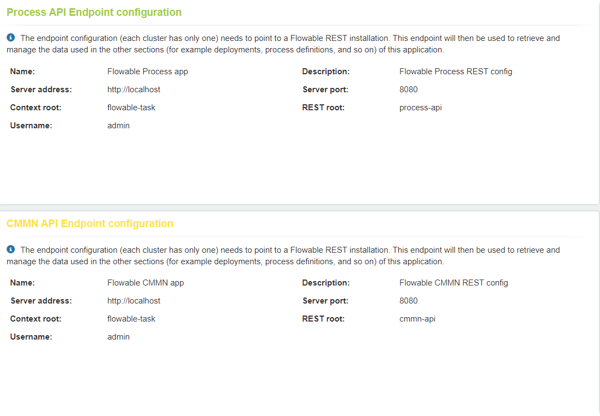
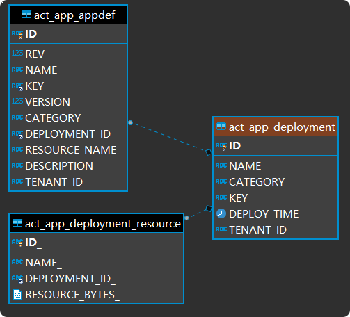

## Flowable Database Structure

### 0. intro
这篇文档主要记录Flowable的数据结构。

Flowable为了存储其业务数据，提供了一系列固定的表结构。当Flowable启动的时候，如果在当前数据库中不存在需要的表，默认会在数据库中依照脚本进行自动创建，并且Flowable利用liquibase为其管理数据库版本，当Flowable发现当前数据库版本为较低版本时，默认会自动完成数据库版本的升级。

但是，如果应用并不希望Flowable-Engine自动完成数据库的修改，或者在生产环境下应用没有修改数据库的权限，就需要在应用中添加如下配置项，并手动完成数据库配置：

``flowable.database-schema-update=false``

### 1. flowable engine中使用了哪些表？
```text
act_adm_databasechangelog
act_adm_databasechangeloglock
act_adm_server_config
act_app_appdef
act_app_databasechangelog
act_app_databasechangeloglock
act_app_deployment
act_app_deployment_resource
act_cmmn_casedef
act_cmmn_databasechangelog
act_cmmn_databasechangeloglock
act_cmmn_deployment
act_cmmn_deployment_resource
act_cmmn_hi_case_inst
act_cmmn_hi_mil_inst
act_cmmn_hi_plan_item_inst
act_cmmn_ru_case_inst
act_cmmn_ru_mil_inst
act_cmmn_ru_plan_item_inst
act_cmmn_ru_sentry_part_inst
act_co_content_item
act_co_databasechangelog
act_co_databasechangeloglock
act_de_databasechangelog
act_de_databasechangeloglock
act_de_model
act_de_model_history
act_de_model_relation
act_dmn_databasechangelog
act_dmn_databasechangeloglock
act_dmn_decision_table
act_dmn_deployment
act_dmn_deployment_resource
act_dmn_hi_decision_execution
act_evt_log
act_fo_databasechangelog
act_fo_databasechangeloglock
act_fo_form_definition
act_fo_form_deployment
act_fo_form_instance
act_fo_form_resource
act_ge_bytearray
act_ge_property
act_hi_actinst
act_hi_attachment
act_hi_comment
act_hi_detail
act_hi_entitylink
act_hi_identitylink
act_hi_procinst
act_hi_taskinst
act_hi_tsk_log
act_hi_varinst
act_id_bytearray
act_id_group
act_id_info
act_id_membership
act_id_priv
act_id_priv_mapping
act_id_property
act_id_token
act_id_user
act_procdef_info
act_re_deployment
act_re_model
act_re_procdef
act_ru_actinst
act_ru_deadletter_job
act_ru_entitylink
act_ru_event_subscr
act_ru_execution
act_ru_history_job
act_ru_identitylink
act_ru_job
act_ru_suspended_job
act_ru_task
act_ru_timer_job
act_ru_variable
flw_channel_definition
flw_ev_databasechangelog
flw_ev_databasechangeloglock
flw_event_definition
flw_event_deployment
flw_event_resource
flw_ru_batch
flw_ru_batch_part
```
flowable engine中使用的表其命名都是具有规律的

首先，flowable中所有的表都是以**act**（activity）或**flw**（flowable）作为开头的。其次，表名的第二部分标识的是表所对应的flowable模块。最后，表名的第三部分则是数据在该模块下的具体作用（*一张表不一定只对应一个flowable对象*）

1. databasechangelog

    以databasechangelog结尾的表是liquibase创建的表，其作用是记录相关表的更新记录，用以追踪当前数据库的具体版本，以此决定是否执行更新数据库的sql脚本

    一个databasechangelog对应flowable engine的多张表，其内容如下所示：
    
    <details>
      <summary>Click to expand!</summary>
     
     ```xml
     <?xml version="1.0" encoding="UTF-8"?>
     <databaseChangeLog xmlns="http://www.liquibase.org/xml/ns/dbchangelog" xmlns:xsi="http://www.w3.org/2001/XMLSchema-instance" xmlns:ext="http://www.liquibase.org/xml/ns/dbchangelog-ext"
         xsi:schemaLocation="http://www.liquibase.org/xml/ns/dbchangelog 
                             http://www.liquibase.org/xml/ns/dbchangelog/dbchangelog-3.0.xsd
                             http://www.liquibase.org/xml/ns/dbchangelog-ext 
                             http://www.liquibase.org/xml/ns/dbchangelog/dbchangelog-ext.xsd">
     
         <changeSet id="1" author="flowable">
     
             <createTable tableName="ACT_APP_DEPLOYMENT">
                 <column name="ID_" type="varchar(255)">
                     <constraints primaryKey="true" nullable="false" />
                 </column>
                 <column name="NAME_" type="varchar(255)" />
                 <column name="CATEGORY_" type="varchar(255)">
                     <constraints nullable="true" />
                 </column>
                 <column name="KEY_" type="varchar(255)">
                     <constraints nullable="true" />
                 </column>
                 <column name="DEPLOY_TIME_" type="datetime">
                     <constraints nullable="true" />
                 </column>
                 <column name="TENANT_ID_" type="varchar(255)" defaultValue="" />
             </createTable>
     
             <createTable tableName="ACT_APP_DEPLOYMENT_RESOURCE">
                 <column name="ID_" type="varchar(255)">
                     <constraints primaryKey="true" nullable="false" primaryKeyName="PK_APP_DEPLOYMENT_RESOURCE" />
                 </column>
                 <column name="NAME_" type="varchar(255)" />
                 <column name="DEPLOYMENT_ID_" type="varchar(255)" />
                 <column name="RESOURCE_BYTES_" type="longblob">
                     <constraints nullable="true" />
                 </column>
             </createTable>
             
             <addForeignKeyConstraint constraintName="ACT_FK_APP_RSRC_DPL" 
                 referencedTableName="ACT_APP_DEPLOYMENT"
                 referencedColumnNames="ID_" 
                 baseTableName="ACT_APP_DEPLOYMENT_RESOURCE" 
                 baseColumnNames="DEPLOYMENT_ID_" />
                 
             <createIndex tableName="ACT_APP_DEPLOYMENT_RESOURCE" indexName="ACT_IDX_APP_RSRC_DPL">
                 <column name="DEPLOYMENT_ID_" />
             </createIndex>            
     
             <createTable tableName="ACT_APP_APPDEF">
                 <column name="ID_" type="varchar(255)">
                     <constraints primaryKey="true" nullable="false" />
                 </column>
                 <column name="REV_" type="integer">
                     <constraints nullable="false" />
                 </column>
                 <column name="NAME_" type="varchar(255)" />
                 <column name="KEY_" type="varchar(255)">
                     <constraints nullable="false" />
                 </column>
                 <column name="VERSION_" type="integer">
                     <constraints nullable="false" />
                 </column>
                 <column name="CATEGORY_" type="varchar(255)" />
                 <column name="DEPLOYMENT_ID_" type="varchar(255)" />
                 <column name="RESOURCE_NAME_" type="varchar(4000)" />
                 <column name="DESCRIPTION_" type="varchar(4000)" />
                 <column name="TENANT_ID_" type="varchar(255)" defaultValue="" />
             </createTable>
             
             <addForeignKeyConstraint constraintName="ACT_FK_APP_DEF_DPLY" 
                 referencedTableName="ACT_APP_DEPLOYMENT"
                 referencedColumnNames="ID_" 
                 baseTableName="ACT_APP_APPDEF" 
                 baseColumnNames="DEPLOYMENT_ID_" />
                 
             <createIndex tableName="ACT_APP_APPDEF" indexName="ACT_IDX_APP_DEF_DPLY">
                 <column name="DEPLOYMENT_ID_" />
             </createIndex>
     
         </changeSet>
     
         <changeSet id="2" author="flowable" dbms="mysql">
     
             <modifyDataType tableName="ACT_APP_DEPLOYMENT" columnName="DEPLOY_TIME_" newDataType="datetime(3)" />
     
         </changeSet>
     
         <changeSet id="3" author="flowable">
     
             <createIndex tableName="ACT_APP_APPDEF" indexName="ACT_IDX_APP_DEF_UNIQ" unique="true">
                 <column name="KEY_" />
                 <column name="VERSION_" />
                 <column name="TENANT_ID_" />
             </createIndex>
     
         </changeSet>
     
     </databaseChangeLog>

     ```
    </details>
    
2. databsechangeloglock
    
    以databasechangeloglock结尾的表是liquibase用作并发控制的表，其作用是防止并发场景下changelog对数据库做出重复的操作，内部记录了当前正在进行的liquibase数据库操作
3. app

    第二部分为app的表是与flowable engine中的app engine相关联的表，负责的是flowable中与app相关数据
4. cmmn （case management model and notation）
    
    第二部分为cmmn的表是与flowable engine中的cmmn engine相关联的表，负责的是flowable的cmmn相关数据
5. de
    
6. dmn（decision management and notation）

    第二部分为dmn的表是与flowable engine中的dmn engine相关联的表，负责的是flowable的dmn相关数据
7. fo（form）
    
    第二部分为fo的表是与flowable中的表单功能相关的数据库，记录了表单的相关数据
8. ge（general data）

    第二部分为ge的表是flowable用来存储通用数据的数据库，一般用来存储图片等二进制数据
9. hi（history）

    第二部分为hi的表是flowable用来存储历史数据的数据库，里面存储了过往版本的历史数据（app，process等）
10. id（identity management）

    第二部分为id的表是flowable存储用户、用户组、用户权限等信息的数据库，对应的是flowable的idm-engine模块。但是，由于集成flowable-engine的应用一般拥有自己的身份认证体系，所以这些表有时并没有数据
11. re（repository）

    第二部分为re的表
12. ru（runtime）
    
    第二部分为ru的表是flowable存储运行时数据的数据库，例如：当一个流程到达一个user-task的时候，流程就进入了wait-state，此时flowable会将当前的运行时相关对象持久化。当流程被再次激活时（用户提交表单等），又会从数据库中取出数据，继续进行流程。
13. channel & event

    第二部分为channel & event的表是与flowable engine中的event registry engine相关联的数据库，其中记录了需要监听的事件，以及消息通道等数据。当应用启动或流程需要激活一个消息监听的时候，会从数据库中取出相关数据。

### 2. flowable中每张表的作用是什么？
下面按顺序说明一下每张表在flowable中的作用，有关liquibase的表就不再次解释了
1. act_adm_server_config

    flowable提供了一个admin控制台，其url为*http://localhost:8080/flowable-admin*，利用控制台我们能够查看flowable内部各个子应用的运行情况。
    act_adm_server_config存放着flowable内各个子应用的配置信息，admin会使用这些配置信息去调用各个应用的rest api，以实现对应用的控制和监控。
    
    但是在集成flowable engine的情况下，一般不会使用admin控制台，所以这个数据库内的数据没有很大的用处。
    
    

2. act_app_appdef
    
    

3. act_app_deployment
4. act_app_deployment_resource


act_cmmn_casedef
act_cmmn_deployment
act_cmmn_deployment_resource
act_cmmn_hi_case_inst
act_cmmn_hi_mil_inst
act_cmmn_hi_plan_item_inst
act_cmmn_ru_case_inst
act_cmmn_ru_mil_inst
act_cmmn_ru_plan_item_inst
act_cmmn_ru_sentry_part_inst

act_de_model


act_de_model_history
act_de_model_relation


act_dmn_decision_table
act_dmn_deployment
act_dmn_deployment_resource
act_dmn_hi_decision_execution


act_evt_log


act_fo_form_definition
act_fo_form_deployment
act_fo_form_instance
act_fo_form_resource

act_ge_bytearray
act_ge_property

act_hi_actinst
act_hi_attachment
act_hi_comment
act_hi_detail
act_hi_entitylink
act_hi_identitylink
act_hi_procinst
act_hi_taskinst
act_hi_tsk_log
act_hi_varinst

act_id_bytearray
act_id_group
act_id_info
act_id_membership
act_id_priv
act_id_priv_mapping
act_id_property
act_id_token
act_id_user

act_procdef_info

act_re_deployment
act_re_model
act_re_procdef

act_ru_actinst
act_ru_deadletter_job
act_ru_entitylink
act_ru_event_subscr
act_ru_execution
act_ru_history_job
act_ru_identitylink
act_ru_job
act_ru_suspended_job
act_ru_task
act_ru_timer_job
act_ru_variable

flw_channel_definition
flw_event_definition
flw_event_deployment
flw_event_resource

flw_ru_batch
flw_ru_batch_part

### 3. The Flow of Flowable

1. appModel —— appDeployment —— appDef

    **"/rest/app-definitions/{modelId}/publish" 完成appModel向appDeployment的转化**
    
    * 请求publish接口传入appModel的modelId（AppDefinitionResource）
    * 根据modelId在act_de_model中查找到对应model （AppDefinitionImportService）
    * 解析model中的model_editor_json得到appDefinition(AppDefinitionPublishService)
        ```json
          {
            "models": [
              {
                "id": "a245f9866bcd211eab87cc2cfcac4a946",
                "name": "john-export-07020311",
                "version": 0,
                "modelType": 0,
                "description": "john-export-070203",
                "stencilSetId": null,
                "createdBy": "u15916971601191",
                "lastUpdatedBy": "u15916971601191",
                "lastUpdated": 1593742131988
              }
            ]
          }

        ```
        ```java
          public class AppDefinition {
          
              protected List<AppModelDefinition> models;
              protected List<AppModelDefinition> cmmnModels;
              protected String name;
              protected String key;
              protected String theme;
              protected String icon;
              protected String groupsAccess;
              protected String usersAccess;
        
              .....
        }

        ```
    * 利用appModel和appDefinition生成有关app的二进制数据，并根据appModel的key确定资源的名称（BaseAppDefinitionService）
        ```
        String appDefinitionJson = getAppDefinitionJson(appDefinitionModel, appDefinition);
        byte[] appDefinitionJsonBytes = appDefinitionJson.getBytes(StandardCharsets.UTF_8);
        
        deployableAssets.put(appDefinitionModel.getKey() + ".app", appDefinitionJsonBytes);

        ```
    * 依次解析appModel中的所有models（BaseAppDefinitionService）
        ```
        protected void createDeployableAppModels(Model appDefinitionModel, AppDefinition appDefinition, Map<String, byte[]> deployableAssets, 
                            Map<String, Model> formMap, Map<String, Model> decisionTableMap, Map<String, Model> caseModelMap, Map<String, Model> processModelMap) {
                
                List<AppModelDefinition> appModels = new ArrayList<>();
                if (appDefinition.getModels() != null) {
                    appModels.addAll(appDefinition.getModels());
                }
                
                if (appDefinition.getCmmnModels() != null) {
                    appModels.addAll(appDefinition.getCmmnModels());
                }
                
                for (AppModelDefinition appModelDef : appModels) {
                    
                    if (caseModelMap.containsKey(appModelDef.getId()) || processModelMap.containsKey(appModelDef.getId())) {
                        return;
                    }
                    
                    # 这个地方又再次从act_de_model中查找models，不过此时的models是processModel了
                    AbstractModel model = modelService.getModel(appModelDef.getId());
                    if (model == null) {
                        throw new BadRequestException(String.format("Model %s for app definition %s could not be found", appModelDef.getId(), appDefinitionModel.getId()));
                    }
        
                    createDeployableModels(model, deployableAssets, formMap, decisionTableMap, caseModelMap, processModelMap);
                }
            }

        ```
    * 将解析完成的所有二进制资源打zip包
    * 利用rest api上传deployment (*“/app-repository/deployments”*)，并用appModel的key和name作为deployment的key和name （AppDefinitionPublishService）
        ```
          if (deployZipArtifact != null) {
              deployZipArtifact(deployableZipName, deployZipArtifact, appDefinitionModel.getKey(), appDefinitionModel.getName());
          }
        ```
    * 使用deploymentBuilder完成deploy，最后会使用appEngineConfiguration中的多个deployer层层解析文件完成各个资源的deployment(AppDeploymentCollectionResource)
        ```
           AppDeployment deployment = deploymentBuilder.deploy();

        ```
    
    appDeployment向appDef的转化
    * AppDefinitionEntityImpl
    
 2. 