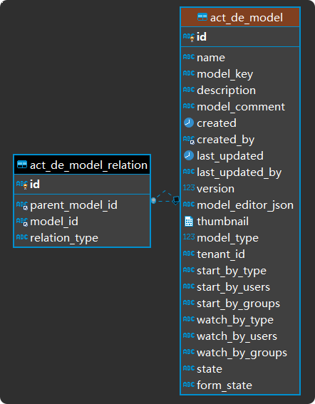

## Flowable Database Structure

### 0. intro
这篇文档主要记录Flowable的数据结构。

Flowable为了存储其业务数据，提供了一系列固定的表结构。当Flowable启动的时候，如果在当前数据库中不存在需要的表，默认会在数据库中依照脚本进行自动创建，并且Flowable利用liquibase为其管理数据库版本，当Flowable发现当前数据库版本为较低版本时，默认会自动完成数据库版本的升级。

但是，如果应用并不希望Flowable-Engine自动完成数据库的修改，或者在生产环境下应用没有修改数据库的权限，就需要在应用中添加如下配置项，并手动完成数据库配置：

``flowable.database-schema-update=false``

### 1. flowable engine中使用了哪些表？
```text
act_adm_databasechangelog
act_adm_databasechangeloglock
act_adm_server_config
act_app_appdef
act_app_databasechangelog
act_app_databasechangeloglock
act_app_deployment
act_app_deployment_resource
act_cmmn_casedef
act_cmmn_databasechangelog
act_cmmn_databasechangeloglock
act_cmmn_deployment
act_cmmn_deployment_resource
act_cmmn_hi_case_inst
act_cmmn_hi_mil_inst
act_cmmn_hi_plan_item_inst
act_cmmn_ru_case_inst
act_cmmn_ru_mil_inst
act_cmmn_ru_plan_item_inst
act_cmmn_ru_sentry_part_inst
act_co_content_item
act_co_databasechangelog
act_co_databasechangeloglock
act_de_databasechangelog
act_de_databasechangeloglock
act_de_model
act_de_model_history
act_de_model_relation
act_dmn_databasechangelog
act_dmn_databasechangeloglock
act_dmn_decision_table
act_dmn_deployment
act_dmn_deployment_resource
act_dmn_hi_decision_execution
act_evt_log
act_fo_databasechangelog
act_fo_databasechangeloglock
act_fo_form_definition
act_fo_form_deployment
act_fo_form_instance
act_fo_form_resource
act_ge_bytearray
act_ge_property
act_hi_actinst
act_hi_attachment
act_hi_comment
act_hi_detail
act_hi_entitylink
act_hi_identitylink
act_hi_procinst
act_hi_taskinst
act_hi_tsk_log
act_hi_varinst
act_id_bytearray
act_id_group
act_id_info
act_id_membership
act_id_priv
act_id_priv_mapping
act_id_property
act_id_token
act_id_user
act_procdef_info
act_re_deployment
act_re_model
act_re_procdef
act_ru_actinst
act_ru_deadletter_job
act_ru_entitylink
act_ru_event_subscr
act_ru_execution
act_ru_history_job
act_ru_identitylink
act_ru_job
act_ru_suspended_job
act_ru_task
act_ru_timer_job
act_ru_variable
flw_channel_definition
flw_ev_databasechangelog
flw_ev_databasechangeloglock
flw_event_definition
flw_event_deployment
flw_event_resource
flw_ru_batch
flw_ru_batch_part
```
flowable engine中使用的表其命名都是具有规律的

首先，flowable中所有的表都是以**act**（activity）或**flw**（flowable）作为开头的。其次，表名的第二部分标识的是表所对应的flowable模块。最后，表名的第三部分则是数据在该模块下的具体作用（*一张表不一定只对应一个flowable对象*）

1. databasechangelog

    以databasechangelog结尾的表是liquibase创建的表，其作用是记录相关表的更新记录，用以追踪当前数据库的具体版本，以此决定是否执行更新数据库的sql脚本

    一个databasechangelog对应flowable engine的多张表，其内容如下所示：
    
    <details>
      <summary>Click to expand!</summary>
     
     ```xml
     <?xml version="1.0" encoding="UTF-8"?>
     <databaseChangeLog xmlns="http://www.liquibase.org/xml/ns/dbchangelog" xmlns:xsi="http://www.w3.org/2001/XMLSchema-instance" xmlns:ext="http://www.liquibase.org/xml/ns/dbchangelog-ext"
         xsi:schemaLocation="http://www.liquibase.org/xml/ns/dbchangelog 
                             http://www.liquibase.org/xml/ns/dbchangelog/dbchangelog-3.0.xsd
                             http://www.liquibase.org/xml/ns/dbchangelog-ext 
                             http://www.liquibase.org/xml/ns/dbchangelog/dbchangelog-ext.xsd">
     
         <changeSet id="1" author="flowable">
     
             <createTable tableName="ACT_APP_DEPLOYMENT">
                 <column name="ID_" type="varchar(255)">
                     <constraints primaryKey="true" nullable="false" />
                 </column>
                 <column name="NAME_" type="varchar(255)" />
                 <column name="CATEGORY_" type="varchar(255)">
                     <constraints nullable="true" />
                 </column>
                 <column name="KEY_" type="varchar(255)">
                     <constraints nullable="true" />
                 </column>
                 <column name="DEPLOY_TIME_" type="datetime">
                     <constraints nullable="true" />
                 </column>
                 <column name="TENANT_ID_" type="varchar(255)" defaultValue="" />
             </createTable>
     
             <createTable tableName="ACT_APP_DEPLOYMENT_RESOURCE">
                 <column name="ID_" type="varchar(255)">
                     <constraints primaryKey="true" nullable="false" primaryKeyName="PK_APP_DEPLOYMENT_RESOURCE" />
                 </column>
                 <column name="NAME_" type="varchar(255)" />
                 <column name="DEPLOYMENT_ID_" type="varchar(255)" />
                 <column name="RESOURCE_BYTES_" type="longblob">
                     <constraints nullable="true" />
                 </column>
             </createTable>
             
             <addForeignKeyConstraint constraintName="ACT_FK_APP_RSRC_DPL" 
                 referencedTableName="ACT_APP_DEPLOYMENT"
                 referencedColumnNames="ID_" 
                 baseTableName="ACT_APP_DEPLOYMENT_RESOURCE" 
                 baseColumnNames="DEPLOYMENT_ID_" />
                 
             <createIndex tableName="ACT_APP_DEPLOYMENT_RESOURCE" indexName="ACT_IDX_APP_RSRC_DPL">
                 <column name="DEPLOYMENT_ID_" />
             </createIndex>            
     
             <createTable tableName="ACT_APP_APPDEF">
                 <column name="ID_" type="varchar(255)">
                     <constraints primaryKey="true" nullable="false" />
                 </column>
                 <column name="REV_" type="integer">
                     <constraints nullable="false" />
                 </column>
                 <column name="NAME_" type="varchar(255)" />
                 <column name="KEY_" type="varchar(255)">
                     <constraints nullable="false" />
                 </column>
                 <column name="VERSION_" type="integer">
                     <constraints nullable="false" />
                 </column>
                 <column name="CATEGORY_" type="varchar(255)" />
                 <column name="DEPLOYMENT_ID_" type="varchar(255)" />
                 <column name="RESOURCE_NAME_" type="varchar(4000)" />
                 <column name="DESCRIPTION_" type="varchar(4000)" />
                 <column name="TENANT_ID_" type="varchar(255)" defaultValue="" />
             </createTable>
             
             <addForeignKeyConstraint constraintName="ACT_FK_APP_DEF_DPLY" 
                 referencedTableName="ACT_APP_DEPLOYMENT"
                 referencedColumnNames="ID_" 
                 baseTableName="ACT_APP_APPDEF" 
                 baseColumnNames="DEPLOYMENT_ID_" />
                 
             <createIndex tableName="ACT_APP_APPDEF" indexName="ACT_IDX_APP_DEF_DPLY">
                 <column name="DEPLOYMENT_ID_" />
             </createIndex>
     
         </changeSet>
     
         <changeSet id="2" author="flowable" dbms="mysql">
     
             <modifyDataType tableName="ACT_APP_DEPLOYMENT" columnName="DEPLOY_TIME_" newDataType="datetime(3)" />
     
         </changeSet>
     
         <changeSet id="3" author="flowable">
     
             <createIndex tableName="ACT_APP_APPDEF" indexName="ACT_IDX_APP_DEF_UNIQ" unique="true">
                 <column name="KEY_" />
                 <column name="VERSION_" />
                 <column name="TENANT_ID_" />
             </createIndex>
     
         </changeSet>
     
     </databaseChangeLog>

     ```
    </details>
    
2. databsechangeloglock
    
    以databasechangeloglock结尾的表是liquibase用作并发控制的表，其作用是防止并发场景下changelog对数据库做出重复的操作，内部记录了当前正在进行的liquibase数据库操作
3. app

    第二部分为app的表是与flowable engine中的app engine相关联的表，负责的是flowable中与app相关数据
4. cmmn （case management model and notation）
    
    第二部分为cmmn的表是与flowable engine中的cmmn engine相关联的表，负责的是flowable的cmmn相关数据
5. de

    第二部分为de的表是与flowable中的jsonModel相关联的表，存储的是flowable设计阶段时保存下来的jsonModel。在这张表中的jsonModel并不能保证正确，是一个用户临时保存的结果。
6. dmn（decision management and notation）

    第二部分为dmn的表是与flowable engine中的dmn engine相关联的表，负责的是flowable的dmn相关数据
7. fo（form）
    
    第二部分为fo的表是与flowable中的表单功能相关的数据库，记录了表单的相关数据
8. ge（general data）

    第二部分为ge的表是flowable用来存储通用数据的数据库，一般用来存储图片等二进制数据
9. hi（history）

    第二部分为hi的表是flowable用来存储历史数据的数据库，里面存储了过往版本的历史数据（app，process等）
10. id（identity management）

    第二部分为id的表是flowable存储用户、用户组、用户权限等信息的数据库，对应的是flowable的idm-engine模块。但是，由于集成flowable-engine的应用一般拥有自己的身份认证体系，所以这些表有时并没有数据
11. re（repository）

    第二部分为re的表
12. ru（runtime）
    
    第二部分为ru的表是flowable存储运行时数据的数据库，例如：当一个流程到达一个user-task的时候，流程就进入了wait-state，此时flowable会将当前的运行时相关对象持久化。当流程被再次激活时（用户提交表单等），又会从数据库中取出数据，继续进行流程。
13. channel & event

    第二部分为channel & event的表是与flowable engine中的event registry engine相关联的数据库，其中记录了需要监听的事件，以及消息通道等数据。当应用启动或流程需要激活一个消息监听的时候，会从数据库中取出相关数据。

### 2. flowable中每张表的作用是什么？
下面按顺序以及重要程度说明一下每张表在flowable中的作用，有关liquibase的表就不再次解释了
1. act_adm_server_config

    flowable提供了一个admin控制台，其url为*http://localhost:8080/flowable-admin*，利用控制台我们能够查看flowable内部各个子应用的运行情况。
    act_adm_server_config存放着flowable内各个子应用的配置信息，admin会使用这些配置信息去调用各个应用的rest api，以实现对应用的控制和监控。
    
    但是在集成flowable engine的情况下，一般不会使用admin控制台，所以这个数据库内的数据没有很大的用处。
    
    

2. act_app_appdef

    act_app_appdef中存储着appDefinition信息。每当app发布时（publish），会在这条数据库中插入一条相关数据，或者更新已有的appDefinition。
    所以，act_app_appdef中存储的是对应app的最新版本信息，当根据app查找流程时，返回的也是最新的流程信息。
    
    act_app_appdef与act_app_deployment和act_app_deployment_resource具有以下关联关系：
    

3. act_app_deployment
    
    act_app_deployment存储着app的deployment信息。当app publish的时候，会在这条数据库中插入一条数据，值得注意的是act_app_deployment是没有version的，也就是说相同的name&key的app可能在这张表中具有多条记录，这也对应的是app的多次发布，每次发布都插入一条新的记录，并且更新act_app_appdef的version和deploymentId等相关信息。
    
    为什么act_app_appdef需要记录version（而不是保存旧版本的记录），而act_app_deployment不需要version呢？这是因为act_app_appdef是用来启动新的实例（instance）的，所以默认只会启用最新版本的实例。而deployment则在实例运行时的整个流程中都被使用（可能存在旧版本的实例），所以我们需要保存旧版本的deployment。
4. act_app_deployment_resource

    act_app_deployment_resource存储着deployment的相关二进制信息。需要注意的是，这张表并不是完全给app记录二进制信息的。实际上，这张表同时记录了app，process和form的二进制信息。
    
    对于app，其中记录的是访问权限等信息
    ```json
    {
      "key": "a6d740d3db92211ea9f07105badde4ea7",
      "name": "app_event registry event test2",
      "description": null,
      "theme": null,
      "icon": null,
      "usersAccess": null,
      "groupsAccess": null
    }
    ```
    对于process，其中则记载的是由jsonModel转化而来的bpmn文件
    ```xml
    <?xml version="1.0" encoding="UTF-8"?>
    <definitions xmlns="http://www.omg.org/spec/BPMN/20100524/MODEL" xmlns:xsi="http://www.w3.org/2001/XMLSchema-instance" xmlns:xsd="http://www.w3.org/2001/XMLSchema" xmlns:flowable="http://flowable.org/bpmn" xmlns:bpmndi="http://www.omg.org/spec/BPMN/20100524/DI" xmlns:omgdc="http://www.omg.org/spec/DD/20100524/DC" xmlns:omgdi="http://www.omg.org/spec/DD/20100524/DI" typeLanguage="http://www.w3.org/2001/XMLSchema" expressionLanguage="http://www.w3.org/1999/XPath" targetNamespace="http://www.flowable.org/processdef">
      <process id="eventregistryeventtestkey" name="event registry event test2" isExecutable="true">
        <documentation>event registry event test2</documentation>
        <startEvent id="startEvent1" flowable:initiator="initiator" flowable:formKey="helloPeopleRequstForm" flowable:formFieldValidation="true"></startEvent>
        <userTask id="sid-1F4C9239-7C5B-4BB6-B8DA-9650DE8A0806" name="test user task"></userTask>
        <sequenceFlow id="sid-DBDCF092-8605-4174-86B4-C4BA05162F42" sourceRef="startEvent1" targetRef="sid-1F4C9239-7C5B-4BB6-B8DA-9650DE8A0806"></sequenceFlow>
        <boundaryEvent id="sid-7BFBCEAE-7982-46B4-957E-81FC86AF0330" name="custom firmware upgrade finish test" attachedToRef="sid-1F4C9239-7C5B-4BB6-B8DA-9650DE8A0806">
          <extensionElements>
            <flowable:eventType xmlns:flowable="http://flowable.org/bpmn"><![CDATA[STATISTICS_UPDATED]]></flowable:eventType>
            <flowable:eventName xmlns:flowable="http://flowable.org/bpmn"><![CDATA[DCM Firmware Upgrade Event]]></flowable:eventName>
            <flowable:eventOutParameter xmlns:flowable="http://flowable.org/bpmn" source="outcome" sourceType="string" target="outcome"></flowable:eventOutParameter>
            <flowable:eventCorrelationParameter xmlns:flowable="http://flowable.org/bpmn" name="jobId" type="string" value="test112233"></flowable:eventCorrelationParameter>
            <flowable:channelKey xmlns:flowable="http://flowable.org/bpmn"><![CDATA[DCM_CHANNEL_KEY]]></flowable:channelKey>
            <flowable:channelName xmlns:flowable="http://flowable.org/bpmn"><![CDATA[DCM CHANNEL NAME]]></flowable:channelName>
            <flowable:channelType xmlns:flowable="http://flowable.org/bpmn"><![CDATA[kafka]]></flowable:channelType>
            <flowable:channelDestination xmlns:flowable="http://flowable.org/bpmn"><![CDATA[DCM.COMMON.NEW.EVENTS]]></flowable:channelDestination>
            <flowable:keyDetectionType xmlns:flowable="http://flowable.org/bpmn"><![CDATA[jsonPointer]]></flowable:keyDetectionType>
            <flowable:keyDetectionValue xmlns:flowable="http://flowable.org/bpmn"><![CDATA[/eventType]]></flowable:keyDetectionValue>
            <flowable:tenantDetectionType xmlns:flowable="http://flowable.org/bpmn"><![CDATA[jsonPointer]]></flowable:tenantDetectionType>
            <flowable:tenantDetectionValue xmlns:flowable="http://flowable.org/bpmn"><![CDATA[/entity/orgId]]></flowable:tenantDetectionValue>
            <flowable:payloadExtractorDelegate xmlns:flowable="http://flowable.org/bpmn"><![CDATA[${DCMJsonPointerBasedPayloadExtractor}]]></flowable:payloadExtractorDelegate>
          </extensionElements>
        </boundaryEvent>
        <endEvent id="sid-5DBAEFAE-5EE8-477C-A5EE-35D3AE09BE04"></endEvent>
        <sequenceFlow id="sid-2687275B-4586-4A3C-915A-C12146F97188" sourceRef="sid-7BFBCEAE-7982-46B4-957E-81FC86AF0330" targetRef="sid-5DBAEFAE-5EE8-477C-A5EE-35D3AE09BE04"></sequenceFlow>
      </process>
      <bpmndi:BPMNDiagram id="BPMNDiagram_eventregistryeventtestkey">
        <bpmndi:BPMNPlane bpmnElement="eventregistryeventtestkey" id="BPMNPlane_eventregistryeventtestkey">
          <bpmndi:BPMNShape bpmnElement="startEvent1" id="BPMNShape_startEvent1">
            <omgdc:Bounds height="30.0" width="30.0" x="100.0" y="163.0"></omgdc:Bounds>
          </bpmndi:BPMNShape>
          <bpmndi:BPMNShape bpmnElement="sid-1F4C9239-7C5B-4BB6-B8DA-9650DE8A0806" id="BPMNShape_sid-1F4C9239-7C5B-4BB6-B8DA-9650DE8A0806">
            <omgdc:Bounds height="80.0" width="100.0" x="175.0" y="138.0"></omgdc:Bounds>
          </bpmndi:BPMNShape>
          <bpmndi:BPMNShape bpmnElement="sid-7BFBCEAE-7982-46B4-957E-81FC86AF0330" id="BPMNShape_sid-7BFBCEAE-7982-46B4-957E-81FC86AF0330">
            <omgdc:Bounds height="30.0" width="30.0" x="207.08992146153574" y="203.29330055920164"></omgdc:Bounds>
          </bpmndi:BPMNShape>
          <bpmndi:BPMNShape bpmnElement="sid-5DBAEFAE-5EE8-477C-A5EE-35D3AE09BE04" id="BPMNShape_sid-5DBAEFAE-5EE8-477C-A5EE-35D3AE09BE04">
            <omgdc:Bounds height="28.0" width="28.0" x="210.0" y="270.0"></omgdc:Bounds>
          </bpmndi:BPMNShape>
          <bpmndi:BPMNEdge bpmnElement="sid-DBDCF092-8605-4174-86B4-C4BA05162F42" id="BPMNEdge_sid-DBDCF092-8605-4174-86B4-C4BA05162F42">
            <omgdi:waypoint x="129.9499984899576" y="178.0"></omgdi:waypoint>
            <omgdi:waypoint x="174.9999999999917" y="178.0"></omgdi:waypoint>
          </bpmndi:BPMNEdge>
          <bpmndi:BPMNEdge bpmnElement="sid-2687275B-4586-4A3C-915A-C12146F97188" id="BPMNEdge_sid-2687275B-4586-4A3C-915A-C12146F97188">
            <omgdi:waypoint x="222.52433452485704" y="233.23679163600067"></omgdi:waypoint>
            <omgdi:waypoint x="223.59318602958916" y="270.00476110543417"></omgdi:waypoint>
          </bpmndi:BPMNEdge>
        </bpmndi:BPMNPlane>
      </bpmndi:BPMNDiagram>
    </definitions>
    ```
    对于form，其中记录的是form表单的定义model
    ```json
    {
      "name": "HelloFormRequestForm",
      "key": "helloFormRequestForm",
      "version": 0,
      "fields": [
        {
          "fieldType": "FormField",
          "id": "name",
          "name": "Name",
          "type": "text",
          "value": null,
          "required": false,
          "readOnly": false,
          "overrideId": false,
          "placeholder": null,
          "layout": null
        }
      ],
      "outcomes": []
    }
    ```
    > Tips: 在Enos BPM中，由于app是根据process产生的，而appDeployment的name又是根据appModel的key生成的（这里与flowable不同，flowable是根据appModel的name）。所以，我们只需要根据processModelId查找出对应的model_key，接在就能够利用 "name like '%processModelKey%'"在act_app_deployment_resource中查找出相关app和process的相关数据。

5. act_cmmn_casedef
6. act_cmmn_deployment
7. act_cmmn_deployment_resource
8. act_cmmn_hi_case_inst
9. act_cmmn_hi_mil_inst
10. act_cmmn_hi_plan_item_inst
11. act_cmmn_ru_case_inst
12. act_cmmn_ru_mil_inst
13. act_cmmn_ru_plan_item_inst
14. act_cmmn_ru_sentry_part_inst

15. act_de_model
    
    act_de_model存储着用户保存下来的app，process和form等模型的jsonModel。这些jsonModel与act_app_deployment_resource中保存的信息的区别在于，
    首先这些jsonModel只是用户保存的结果，并不能保证正确，而deployment是发布的结果，经过了相关校验能够保存正确。
    其次，需要一张表单独保存最初的jsonModel，方便用户能够随时编辑模型。
    
    需要注意的是，这张表也有version字段，说明这张表也只会保留最近的模型数据。当用户更新jsonModel的时候，里面数据的version就相应的+1。
    
    act_de_model与act_de_model_relation有如下关系：
    

16. act_de_model_history
    
    这张表保存的是model的历史数据，当用户更新app，process和form的jsonModel时，原有的jsonModel就会被保存到这张表中作为记录。
    > Enos BPM由于app是根据process生成的，所以没有保存app history的必要。因此，这张表中只保存了process和form的history。
17. act_de_model_relation
    
    act_de_model_relation这张表是用来保存model之间的父子关系的。例如：当我们创建了一个app，并为其添加了一个process作为bpmn model时，
    在这张表中就会插入一条数据，以表明app是process的父model。因此，我们就能够查询到一个model下有哪些子节点。（process下面添加form也是一样会插入）

18. act_dmn_decision_table
19. act_dmn_deployment
20. act_dmn_deployment_resource
21. act_dmn_hi_decision_execution

22. act_evt_log

23. act_fo_form_definition
    act_fo_form_definition中存储着formDefinition信息。其功能和act_app_appdef类似，也是用在启动form实例上面。同时，也含有version字段，说明这张表保存的是最新版本的version信息。
    
    需要注意的是，这张表并没有和act_app_appdef类似的与其他表的外键关联。但是，类似的关系依然是存在的。
    
    
24. act_fo_form_deployment

    act_fo_form_deployment存储着form的deployment信息。其功能和act_app_deployment类似，当app发布之后，相关的form就会插入一条deployment数据。
    不同点在于，act_fo_form_deployment中具有一个字段parent_deployment_id这是appDeployment没有的（因为appDeployment是最为最上层的父节点），一般这个字段指向的是一个process deployment。
    
    act_fo_form_definition中存储的deployment_id就来自这张表。
    
25. act_fo_form_instance

    act_fo_form_instance存储着form的instance信息。
    
26. act_fo_form_resource

    act_fo_form_resource存储的是form的相关二进制信息，它和act_app_deployment_resource类似，当form发布成功时，就会在这张表中插入一条数据，并且记录相关的deploymentId。
    
    但是，不同的地方是这张表不仅仅记录的是deployment的二进制信息。同时，还会保存每次的表单提交记录。当记录表单提交时，deloyment_id为null
    ```json
    {
      "values": {
        "name": "user1111111111111111",
        "cocos": null,
        "age": "11"
      }
    }
    ```

27. act_ge_bytearray
28. act_ge_property

29. act_hi_actinst
30. act_hi_attachment
31. act_hi_comment
32. act_hi_detail
33. act_hi_entitylink
34. act_hi_identitylink
35. act_hi_procinst
36. act_hi_taskinst
37. act_hi_tsk_log
38. act_hi_varinst

39. act_id_bytearray
40. act_id_group
41. act_id_info
42. act_id_membership
43. act_id_priv
44. act_id_priv_mapping
45. act_id_property
46. act_id_token
47. act_id_user

48. act_procdef_info

49. act_re_deployment
50. act_re_model
51. act_re_procdef

52. act_ru_actinst
53. act_ru_deadletter_job
54. act_ru_entitylink
55. act_ru_event_subscr
56. act_ru_execution
57. act_ru_history_job
58. act_ru_identitylink
59. act_ru_job
60. act_ru_suspended_job
61. act_ru_task
62. act_ru_timer_job
63. act_ru_variable

64. flw_channel_definition
65. flw_event_definition
66. flw_event_deployment
67. flw_event_resource

68. flw_ru_batch
69. flw_ru_batch_part

### 3. The Flow of Flowable

1. appModel — appDeployment — appDef

    **"/rest/app-definitions/{modelId}/publish" 完成appModel向appDeployment的转化**
    
    * 请求publish接口传入appModel的modelId（AppDefinitionResource）
    * 根据modelId在act_de_model中查找到对应model （AppDefinitionImportService）
    * 解析model中的model_editor_json得到appDefinition(AppDefinitionPublishService)
        ```json
          {
            "models": [
              {
                "id": "a245f9866bcd211eab87cc2cfcac4a946",
                "name": "john-export-07020311",
                "version": 0,
                "modelType": 0,
                "description": "john-export-070203",
                "stencilSetId": null,
                "createdBy": "u15916971601191",
                "lastUpdatedBy": "u15916971601191",
                "lastUpdated": 1593742131988
              }
            ]
          }

        ```
        ```java
          public class AppDefinition {
          
              protected List<AppModelDefinition> models;
              protected List<AppModelDefinition> cmmnModels;
              protected String name;
              protected String key;
              protected String theme;
              protected String icon;
              protected String groupsAccess;
              protected String usersAccess;
        
              .....
        }

        ```
    * 利用appModel和appDefinition生成有关app的二进制数据，并根据appModel的key确定资源的名称（BaseAppDefinitionService）
        ```
        String appDefinitionJson = getAppDefinitionJson(appDefinitionModel, appDefinition);
        byte[] appDefinitionJsonBytes = appDefinitionJson.getBytes(StandardCharsets.UTF_8);
        
        deployableAssets.put(appDefinitionModel.getKey() + ".app", appDefinitionJsonBytes);

        ```
    * 依次解析appModel中的所有models（BaseAppDefinitionService）
        ```
        protected void createDeployableAppModels(Model appDefinitionModel, AppDefinition appDefinition, Map<String, byte[]> deployableAssets, 
                            Map<String, Model> formMap, Map<String, Model> decisionTableMap, Map<String, Model> caseModelMap, Map<String, Model> processModelMap) {
                
                List<AppModelDefinition> appModels = new ArrayList<>();
                if (appDefinition.getModels() != null) {
                    appModels.addAll(appDefinition.getModels());
                }
                
                if (appDefinition.getCmmnModels() != null) {
                    appModels.addAll(appDefinition.getCmmnModels());
                }
                
                for (AppModelDefinition appModelDef : appModels) {
                    
                    if (caseModelMap.containsKey(appModelDef.getId()) || processModelMap.containsKey(appModelDef.getId())) {
                        return;
                    }
                    
                    # 这个地方又再次从act_de_model中查找models，不过此时的models是processModel了
                    AbstractModel model = modelService.getModel(appModelDef.getId());
                    if (model == null) {
                        throw new BadRequestException(String.format("Model %s for app definition %s could not be found", appModelDef.getId(), appDefinitionModel.getId()));
                    }
        
                    createDeployableModels(model, deployableAssets, formMap, decisionTableMap, caseModelMap, processModelMap);
                }
            }

        ```
    * 将解析完成的所有二进制资源打zip包
    * 利用rest api上传deployment (*“/app-repository/deployments”*)，并用**appModel的key和name作为deployment的key和name** （AppDefinitionPublishService）
        ```
          if (deployZipArtifact != null) {
              deployZipArtifact(deployableZipName, deployZipArtifact, appDefinitionModel.getKey(), appDefinitionModel.getName());
          }
        ```
    * 使用deploymentBuilder完成deploy，最后会使用appEngineConfiguration中的多个deployer层层解析文件完成各个资源的deployment(AppDeploymentCollectionResource)
        ```
           AppDeployment deployment = deploymentBuilder.deploy();

        ```
    
    appDeployment向appDef的转化
    * AppDefinitionEntityImpl
    
 2. formModel — formDeployment — formDef — formInstance
 
    FormModel的上传和保存 "/app/rest/form-models/{formId}"
    * 请求saveForm接口保存表单信息
    ```json
    {
      "reusable": false,
      "newVersion": false,
      "comment": "",
      "formRepresentation": {
        "id": "8aa09439-aa4b-11ea-8b89-105badde4ea7",
        "name": "event_registry_test_form",
        "key": "event_registry_test_form_key",
        "description": "event_registry_test_form_desc",
        "version": 1,
        "lastUpdatedBy": "admin",
        "lastUpdated": "2020-06-09T12:20:01.327+0000",
        "formDefinition": {
          "name": "event_registry_test_form",
          "key": "event_registry_test_form_key",
          "fields": [
            {
              "fieldType": "FormField",
              "id": "label",
              "name": "Label",
              "type": "text",
              "value": null,
              "required": false,
              "readOnly": false,
              "overrideId": false,
              "placeholder": "aabbccddee",
              "layout": null,
              "params": {
                "minLength": "10",
                "maxLength": "20"
              }
            },
            {
              "fieldType": "FormField",
              "id": "label",
              "name": "Label",
              "type": "integer",
              "value": null,
              "required": false,
              "readOnly": false,
              "overrideId": false,
              "placeholder": null,
              "layout": null,
              "params": {}
            }
          ],
          "outcomes": []
        }
      },
      "formImageBase64": "data:image/png;base64,iVBORw0KGgoAAAANSUhEUgAAASwAAABuCAYAAACdmi6mAAAGOElEQVR4Xu3dvWoUbRQH8CNBDCF+oFUULRRRrK3EwspUXoPoPYgX4HUIXoCFoKCFnVZWdho1wUqjgrJ+RwVlt3iJ8L7vnKyTyZnxt13g7Dzn+Z3hz7IZnt22trb2M7wIECDQA4FtAqsHU9IiAQITAYHlRiBAoDcCAqs3o9IoAQICyz1AgEBvBARWb0alUQIEBJZ7gACB3ggIrN6MSqMECDQG1tevX2N2dpYUAQIEtlxAYG35CDRAgEBWQGBlpdQRILDlAo2Btba2Fjt27Jg0evPmzTh37tw/TX/+/Dnm5uZ+28TS0lIcO3ZsyzemAQIEhifQGFjfv3+P7du3/xZYb9++jT179sSnT58mgfXkyZM4fPhwXLt2Lc6cOSOwhnef2BGBEgJTBdatW7fi1KlTkyAbB9bz589j79698fr168mmfMIqMVtNEBicwIYCa3C7tyECBHolILB6NS7NEvi7BQTW3z1/uyfQK4ENBdb79+9jfn6+VxvULAEC9QWePn2a+u57Q4H15cuX2L17d/3d65AAgV4JPHz4ME6cONHYs8BqJFJAgMBmC4yfNNi/f3/jMgKrkUgBAQKbLSCwNlvY9QkQaE1g0wNrNBpNvs86f/58XL16NT5+/BjXr1+PmZmZuHDhQmsbcSECBIYv0Elg/fjxIx48eBBHjhyJGzduxKVLl+LDhw+xa9eu4QvbIQECrQlsemCNP1GNH3G4fPlyXLlyZdL43bt3Y3V1NS5evNjaRlyIAIHhCywvL8fBgwcbN9r4pfv60xo81tDoqYAAgSkEWnusYf2Joy9fvoyfP/1Q9BTz8BYCBP5HYHyE1b59+xqNGj9hOSK50VABAQIdCQisjqAtQ4DAnws0BtafL+EKBAgQaEdAYLXj6CoECHQgILA6QLYEAQLtCAisdhxdhQCBDgQEVgfIliBAoB0BgdWOo6sQINCBQGNgeQ6rgylYggCBlIDASjEpIkCggoDAqjAFPRAgkBIQWCkmRQQIVBBoDKx/+6n6R48exePHj+Ps2bNx586dWFxcjNu3b8fJkyfj27dvqV+/qLB5PRAg0C+BqQLr3r17cfr06ckpozt37oz79+9P/h6/lpaWBFa/7gHdEuiNwIYC69WrV/Hu3bs4dOhQvHnzJhYWFmJlZSWOHz8+CaqjR4/G+L+Kc3NzvQHQKAEC/RHYUGD1Z1s6JUBgiAICa4hTtScCAxXYUGC9ePHCiaMDvRFsi8BWCszOzrZz4uj6/xI6030rR2ptAsMVaO1Md4E13JvEzghUEWjtV3MEVpWR6oPAcAU2/XcJh0tnZwQIdC0gsLoWtx4BAlMLCKyp6byRAIGuBQRW1+LWI0BgagGBNTWdNxIg0LVAa481rD9xdDQaxfz8fNd7sR4BAgMXePbsWerQhMYn3R2RPPA7xfYI9EhAYPVoWFol8LcLNAbW+EC+8VEyXgQIEOhC4MCBA/+5TGNgddGgNQgQIJAREFgZJTUECJQQEFglxqAJAgQyAgIro6SGAIESAgKrxBg0QYBARkBgZZTUECBQQkBglRiDJggQyAgIrIySGgIESggIrBJj0AQBAhkBgZVRUkOAQAkBgVViDJogQCAjILAySmoIECghILBKjEETBAhkBARWRkkNAQIlBARWiTFoggCBjIDAyiipIUCghIDAKjEGTRAgkBEQWBklNQQIlBAQWCXGoAkCBDICAiujpIYAgRICAqvEGDRBgEBGQGBllNQQIFBCQGCVGIMmCBDICAisjJIaAgRKCAisEmPQBAECGQGBlVFSQ4BACQGBVWIMmiBAICMgsDJKaggQKCEgsEqMQRMECGQEBFZGSQ0BAiUEBFaJMWiCAIGMgMDKKKkhQKCEgMAqMQZNECCQERBYGSU1BAiUEBBYJcagCQIEMgICK6OkhgCBEgICq8QYNEGAQEZAYGWU1BAgUEJAYJUYgyYIEMgICKyMkhoCBEoICKwSY9AEAQIZAYGVUVJDgEAJAYFVYgyaIEAgIyCwMkpqCBAoISCwSoxBEwQIZAQEVkZJDQECJQQEVokxaIIAgYyAwMooqSFAoISAwCoxBk0QIJAREFgZJTUECJQQEFglxqAJAgQyAgIro6SGAIESAgKrxBg0QYBARuAXKmkpKMtNPysAAAAASUVORK5CYII="
    }
    ```
    * 将formModel保存进act_de_model中(ModelServiceImpl)
    
    FormModel向FormDeployment的转化 **"/rest/app-definitions/{modelId}/publish"**
    * 將FormModel解析成二进制数据 （BaseAppDefinitionService）
    ```
    if (formMap.size() > 0) {
        for (String formId : formMap.keySet()) {
            Model formInfo = formMap.get(formId);
            String formModelEditorJson = formInfo.getModelEditorJson();
            byte[] formModelEditorJsonBytes = formModelEditorJson.getBytes(StandardCharsets.UTF_8);
            deployableAssets.put("form-" + formInfo.getKey() + ".form", formModelEditorJsonBytes);
        }
    }
    ```
    * 利用rest api上传deployment (*"/app-repository/deployments"*)，在FormDeployer中完成了Form的部署（FormDeployer）
    ```
    if (formDeploymentBuilder != null) {
        formDeploymentBuilder.parentDeploymentId(deployment.getId());
        if (deployment.getTenantId() != null && deployment.getTenantId().length() > 0) {
            formDeploymentBuilder.tenantId(deployment.getTenantId());
        }

        formDeploymentBuilder.deploy();
    }
    ```
    FormDeployment转换FormDef
    * 在FormDeployer的DployCmd中，调用FormDefinitionDeployer完成FormDefinition的Deploy（org.flowable.form.engine.impl.cmd.DelpyCmd）
    ```
    // Save the data
    CommandContextUtil.getDeploymentEntityManager(commandContext).insert(deployment);
    
    // Actually deploy
    CommandContextUtil.getFormEngineConfiguration().getDeploymentManager().deploy(deployment);
    ```
    FormDef转为FormInstance
    