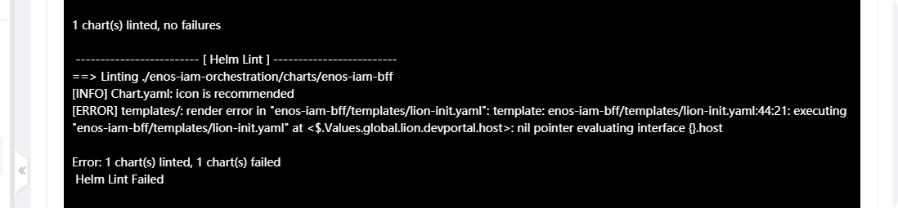
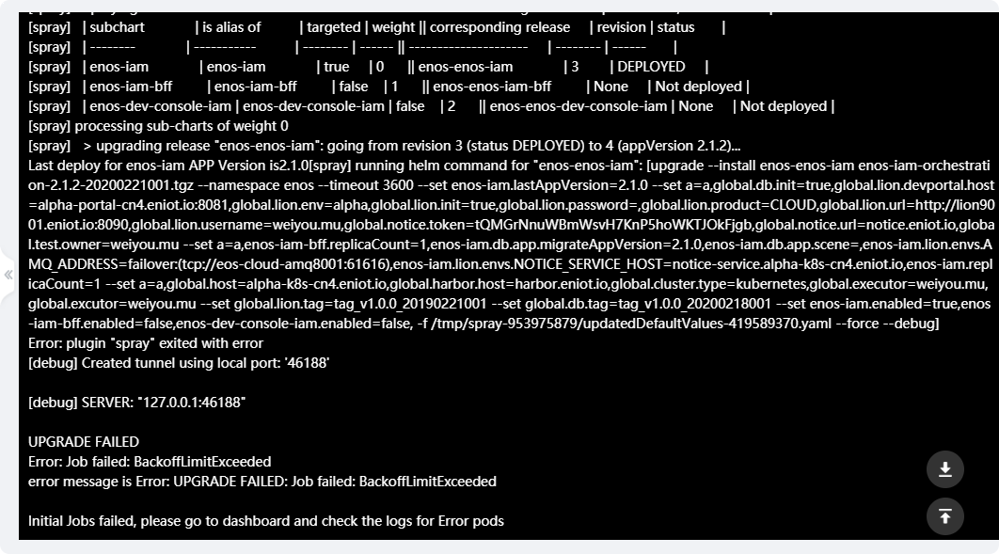

## Helm Chart部署介绍

这篇文档主要介绍公司目前使用的部署工具 - `helm`，以及其相关知识。
阅读文档需要具有一定的k8s使用经验，阅读时间为30min左右。

### 什么是Helm？什么是Chart？
**Chart**是`helm`中的软件包，`helm`与MacOS的`homebrew`，Debian系统的`dpkg`有些相似，只不过helm是cloud native的，是k8s上面的软件包管理系统。

`helm`主要的功能如下所示：
* 创建chart （类似git init）
* chart打包，主要是将chart打包成为一个tgz包 （ecp底层会调用这个api完成chart打包并上传公司自己的仓库）
* 与chart repository交互，以完成chart的上传和下载
* 在k8s集群中安装和卸载程序
* 管理chart的生命周期（安装时创建资源，卸载时清除资源，以及chart hook等）

简单来说，Chart就是Go Language Template + k8s resource definition。通过Go语言的模板功能，我们能够将resource definition中的一些部署参数抽离出来。
部署时，通过部署参数完成模板的渲染，最后将其提交给k8s完成资源的创建。

### 为什么需要使用Helm？
公司从2019年年末（迭代版本为2.1.0）开始使用helm chart部署取代原有的ecp部署（运维通过部署文档完成所有部署配置）。

首先，需要明确的是`helm`不是公司自主开发的应用。目前，国内外已经有很多大厂都在使用`helm`来管理自己的版本迭代 & 部署，根据helm官网的数据超过70%的k8s用户在使用`helm`管理软件包。

使用helm能够加快整个部署流程，而且由于所有部署参数都归到了一个统一的接口，也减少了ops人肉操作导致的错误。

原先，运维使用ecp部署在干净环境部署一套程序，需要先要在环境中为程序创建好资源（Deployment，Service，Ingress...），并且创建一个pipeline来完成最终的部署（build，scan，deploy）。
而使用helm之后，在干净环境的程序部署几乎和常规升级没有区别，因为在chart中我们已经将所有需要的资源都描述完整了。

### 如何编写 & 维护 Chart？
Chart的编写和维护实际上就是对应用所需k8s资源定义文件的编写&维护。所以，维护chart需要对k8s有一定了解，特别是k8s的resource definition。
先以enos sso server的chart为例说明一下chart的目录结构和对应的作用
```text
enos-authz-service-orchestration
├─ README.md
├─ alpha.env
├─ enos-sso-server-orchestration # sso server的helm chart目录
│    ├─ Chart.yaml # 包含chart的基本信息
│    ├─ charts # sso server依赖的子chart
│    │    ├─ auth-service-fe # sso server的前端项目chart
│    │    │    ├─ Chart.yaml
│    │    │    ├─ templates
│    │    │    │    ├─ deployment.yaml
│    │    │    │    ├─ ingress.yaml
│    │    │    │    └─ service.yaml
│    │    │    └─ values.yaml
│    │    └─ enos-sso-server # sso server的后端项目chart
│    │           ├─ Chart.yaml
│    │           ├─ files
│    │           │    ├─ lion # lion配置相关文件
│    │           │    │    └─ enos-authz-service.properties
│    │           │    └─ sql # sql配置相关文件
│    │           │           ├─ 0_2.1.0.sql
│    │           │           ├─ 1_2.1.1.sql
│    │           │           └─ 2_2.1.7.sql
│    │           ├─ templates # 模板文件
│    │           │    ├─ ServiceMonitor.yaml # prometheus resource
│    │           │    ├─ db-configmap.yaml # db init hook所需的configmap
│    │           │    ├─ db-init.yaml # db init hook
│    │           │    ├─ deployment.yaml # sso server的deployment
│    │           │    ├─ ingress.yaml # sso server的ingress
│    │           │    ├─ lion-configmap.yaml # lion init hook所需的configmap
│    │           │    ├─ lion-init.yaml # lion init hook
│    │           │    ├─ pvc.yaml # sso server的pvc
│    │           │    └─ service.yaml # sso server的service
│    │           └─ values.yaml # sso server后端项目的values文件，用来渲染模板文件
│    ├─ requirements.yaml # 对于apiVersion=1的chart，需要将依赖定义在一个单独的文件中
│    └─ values.yaml # sso server的parent value，其中定义有所有在模板中被使用的值
└─ value
       ├─ alpha.yaml # alpha环境下的部署配置值
       └─ beta.yaml # beta环境下的部署配置值
```
#### Chart.yaml
公司是以应用整体的角度来定义一个chart的，而应用的前后端（或者其他依赖应用）是作为整体chart的依赖定义在/**charts**文件夹中。
因此，对于sso-server，虽然只有前端和后端两个项目，但是却有三个chart.yaml（两个子chart.yaml和一个父chart.yaml）
```yaml
# parent chart
apiVersion: v1 # chart的api version，标识chart的版本，公司内部一般使用apiVersion=v1
appVersion: 2.1.7 # app version，在helm中是一个非必填字段，但是在ecp中会使用这个字段判断当前应用版本并进行数据库初始化
description: Enos Authz Service Container Orchestration # 非必填字段
name: enos-sso-server-orchestration # 必填，chart的名称
version: 2.1.7-20200729001-tag # 必填，helm中使用name和version生成对应的tgz包并上传repo，ecp中对version还有额外的要求
```
```yaml
# backend chart
apiVersion: v1
appVersion: 2.1.7
description: sso server chart
name: enos-sso-server
version: 2.1.7-20200729001-tag
```
```yaml
# frontend chart
apiVersion: v1
appVersion: 2.1.7
description: sso server fe chart
name: auth-service-fe
version: 2.1.7-20200729001-tag
```
公司对chart.yaml有如下限制：
* 父chart的name需要和ecp中创建的chart应用保持一致
* 字母小写，中划线连接
* chart的name要和chart所在的文件夹名称一致
* app version需要参照enos的发布版本，版本号符合semver2.0。目前为2.1.X，X为当前月份。
* version字段命名规则参照【Release Version】-yyyymmdd001-tag
* 资源文件的修改需要更新version字段
* 升级子chart version时父chart也需要升级
* 在开发阶段，不要将version字段的后缀设置为`tag`。因为，在ecp中不允许后缀为`tag`的chart重复上传，我们可以将后缀设置为`test`或者`alpha`
在迭代结束后，再将version后缀修改为`tag`.
#### requirement.yaml
当Chart的apiVersion等于v1的时候，chart就需要一个单独的文件来指定其依赖，requirement.yaml就是低版本chart指定依赖的文件
```yaml
dependencies:
- name: enos-sso-server # 子chart name
  version: 2.1.7-20200729001-tag # 子chart version
  repository: "@enos" # 子chart所在的repository, 可以使用@enos这个repository别名
  condition: enos-sso-server.enabled # 子chart的condition，我们在ecp中选择chart模块实际上就是在设置这个值
  alias: enos-sso-server # 别名，optional

- name: auth-service-fe
  version: 2.1.7-20200729001-tag
  repository: "@enos"
  condition: auth-service-fe.enabled
  alias: auth-service-fe
```
requirement.yaml没有很多需要注意的地方，唯一需要记住的是在更新了子chart的版本（version）后requirement.yaml里面的依赖版本也要相应更新

另外，由于公司的chart都是通过/**charts**文件夹显示声明依赖的，所以requirements.yaml文件并不是很重要。
#### values.yaml
values文件是chart中预定义的配置，chart中的模板文件能够使用`.Values`对象获取values.yaml中的值。
需要注意的是，父chart中可以为属性指定scope，指定了scope后，父chart中的属性就可以传递向子chart。
values文件中的scope分为两种`global`和`chart specific`,scope为`global`的属性可以被所有子chart获得，
而scope为子chart名称的属性只能被特定的子chart获得。

公司对values.yaml有一些额外的规定：
1. chart中一定不能存放密码
2. 全局变量统一定义了一些关键字，这些关键字在部署的时候会传入，不需要应用关心
3. 一定需要运维填入的值，我们使用"@TODO"来代替，这样ecp在部署的时候会检测这个值有没有填入
```yaml
# parent values
global:
  lion:
    #是否更新lion数据
    init: "@TODO"
    # 【ecp】lion url http://lion9001.eniot.io:8090
    url: "@TODO"
    # 【ecp】更新lion数据需要的用户名
    username: "@TODO"
    # 【ecp】更新lion数据需要的用户密码
    password:
    #【ecp】 生产为 PRODUCT/PPE
    env: "@TODO"
    # lion上业务分支名称
    product: AUTH
  harbor:
    #【ecp】对应环境的harbor的地址 harbor.eniot.io
    host: "@TODO"
  cluster:
  #【ecp】集群类型 值可选 kubernetes / openshift
    type: "@TODO"
  #【ecp】 用于确定route的后缀 alpha-k8s-cn4.eniot.io
  host: "@TODO"
  #【ecp】执行人信息
  executor: "@TODO"
  db:
     #是否初始化db
    init: "@TODO"
  test:
    owner: xiang.yang@envision-digital.com

enos-sso-server:
  persistence:
    # 已经使用非chart部署过的pvc则改成false，需要通过chart创建改为true
    enabled: false
    # enos-sso-server使用的pvc名称
    name: "@TODO"
    # 块存储 ReadWriteOnce，文件存储 ReadWriteMany
    accessMode: ReadWriteMany
    size: 10Gi
  # 文件储存类型 块存储 azure-disk-ssd，azure-disk-hdd，ceph-rbd-ssd，ceph-rbd-hdd；文件存储 azure-file-hdd，azure-file-sdd，ceph-fs-hdd，ceph-fs-ssd
  storageClassName: azure-file-hdd
  weight: 1
  replicasCount: 2
  lion:
    init: "@TODO"
    envs:
      # k8s cluster name, alpha环境: alpha-k8s-cn4; beta环境: beta-k8s-cn4; ppe环境: apaas-ppe1
      CLUSTER_NAME: "@TODO"
      # SSO Server url alpha环境：https://alpha-enos-authz-service-cn4.eniot.io; beta环境： https://beta-enos-authz-service-cn4.eniot.io; ppe环境： https://enos-authz-service-ppe1.envisioniot.com
      ISS_URL: "@TODO"
      # Session过期时间
      SESSION_TTL: 1200
      # SSO Server Remember-Me 功能是否默认开启 true/false
      REMEMBER_ME_FLAG: "@TODO"
      # SSO Server使用的aes密钥 	a4d9204fdb374adf8145bdcf00331ff6
      AES_KEY: a4d9204fdb374adf8145bdcf00331ff6
  db:
    init: "@TODO"
    app:
      # sso-server从2019年12月份版本开始支持charts部署 12月份版本為2.1.0
      migrateAppVersion: 2.0.9
  resources:
    limits:
      cpu: "4"
      memory: 2.5Gi
    requests:
      cpu: "0.1"
      memory: 600m
auth-service-fe:
  weight: 0
  replicasCount: 1
  resources:
    limits:
      cpu: "1"
      memory: 1.0Gi
    requests:
      cpu: "0.1"
      memory: 500m
```
```yaml
# backend values
# sso server fe全局变量
global:
  cluster:
    type: "@TODO"
  #用于确定route的后缀 alpha-k8s-cn4.eniot.io
  host: "@TODO"
  harbor:
    #需要修改称对应环境的harbor的地址 harbor.eniot.io
    host: "@TODO"
  lion:
    # lion url http://lion9001.eniot.io:8090
    url: "@TODO"
    # 更新lion数据需要的用户名
    username: "@TODO"
    # 更新lion数据需要的用户密码
    password:
    # lion 的环境配置，生产为 PRODUCT
    env: "@TODO"
    # lion 的产品名
    product: "@TODO"
  db:
    init: "@TODO"
  executor: "@TODO"

# SSO Server本地变量
persistence:
  enabled: true
  name: pvc-enos-sso-server
  accessMode: ReadWriteMany
  size: 10Gi
storageClassName: azure-file-hdd

alone:
  enabled: true
replicasCount: 2
lion:
  init: "@TODO"
  envs:
    # k8s cluster name, alpha环境: alpha-k8s-cn4; beta环境: beta-k8s-cn4; ppe环境: apaas-ppe1
    CLUSTER_NAME: "@TODO"
    # SSO Server url alpha环境：https://alpha-enos-authz-service-cn4.eniot.io; beta环境： https://beta-enos-authz-service-cn4.eniot.io; ppe环境： https://enos-authz-service-ppe1.envisioniot.com
    ISS_URL: "@TODO"
    # Session过期时间
    SESSION_TTL: 1200
    # SSO Server Remember-Me 功能是否默认开启 true/false
    REMEMBER_ME_FLAG: "@TODO"
    # SSO Server使用的aes密钥 长度为32位的字符串 a4d9204fdb374adf8145bdcf00331ff6
    AES_KEY: a4d9204fdb374adf8145bdcf00331ff6

db:
  init: "@TODO"
  app:
    migrateAppVersion:
resources:
  limits:
    cpu: "4"
    memory: 2.5Gi
  requests:
    cpu: "0.1"
    memory: 600m
lastAppVersion:
```
```yaml
# frontend values
# sso server fe全局变量
global:
  cluster:
    type: "@TODO"
  #用于确定route的后缀 alpha-k8s-cn4.eniot.io
  host: "@TODO"
  harbor:
    #需要修改称对应环境的harbor的地址 harbor.eniot.io
    host: "@TODO"
  executor: "@TODO"

# sso server fe 本地变量
alone:
  enabled: true
replicasCount: 1
resources:
  limits:
    cpu: "1"
    memory: 1.0Gi
  requests:
    cpu: "0.1"
    memory: 500m
```
#### deployment.yaml
deployment.yaml就是一个基于deployment resource definition的go language template，因此只要对k8s足够熟悉就能够正确地写出模板文件。
```helmyaml
apiVersion: apps/v1 # deployment resource definition的api version，公司使用apiVersion=apps/v1
kind: Deployment # k8s资源类型
metadata: # k8s资源的metadata，我们在ecp和k8s dashboard上面看到的信息就来自于这里
  name: {{ .Chart.Name }} 
  labels: # ecp规定我们的应用必须包含这三个label，ecp会使用这三个label来查找我们的应用，同时k8s内部也会使用这些label完成一些操作
    app: {{ .Chart.Name }}
    appVersion: {{ .Chart.AppVersion | quote }}
    chartVersion: {{ .Chart.Version | quote }}
spec:
  minReadySeconds: 30 # 和滚动发布有关，新pod就绪后过一段时间才会将老pod杀死
  progressDeadlineSeconds: 600 # deployment部署的超时限制
  replicas: {{ .Values.replicasCount }} # 需要启用多少个pod
  selector: # selector，服务选择器，指定的是当前deployment管理哪些pods。所以，我们需要确保template.metadata和selector是一致的。
    matchLabels:
      app: {{ .Chart.Name }}
  strategy: # 定义发布策略
    rollingUpdate:
      maxSurge: 1 # 滚动升级过程中，最多能够额外启动的pod，数值越大，发布越快
      maxUnavailable: 1 # 滚动升级过程中，最多允许的不可用pod，数值越大，发布越快
    type: RollingUpdate # 滚动发布
  template: # 为新创建的pod的template
    metadata:
      labels: # 确保和selector一致
        app: {{ .Chart.Name }}
    spec:
      affinity: # 指定k8s亲和性
        podAntiAffinity: # 指定pod反亲和性
          preferredDuringSchedulingIgnoredDuringExecution: # 软策略
          - podAffinityTerm:
              labelSelector:
                matchLabels:
                  app: {{ .Chart.Name }} # 让不同的pod尽量部署在不同的节点上
              topologyKey: kubernetes.io/hostname
            weight: 100
      containers: # 指定docker container信息
      - name: {{ .Chart.Name }} # container名称
        env: # 环境变量，具体需要哪些值可以根据应用dockerfile来决定
        - name: POD_NAME
          valueFrom:
            fieldRef:
              apiVersion: v1
              fieldPath: metadata.name
        - name: JAVA_OPTS
          value: -Xmx2560m
        image: "{{ .Values.global.harbor.host }}/enos/enos-sso-server:tag_enos-authz-service_20200729_001" # pod的镜像地址
        imagePullPolicy: IfNotPresent # 镜像拉取策略，IfNotPresent：如果本地有就直接使用，否则拉取；Always：直接拉取镜像；Never：直接使用本地镜像，没有就报错
        livenessProbe: # 定义存活探针
          failureThreshold: 3 # 存活探针容许的失败上线
          httpGet: # health check接口
            path: /ssoserver/auth/health
            port: 8080
            scheme: HTTP
          initialDelaySeconds: 120 # 多少秒之后开始探活
          periodSeconds: 10 # 探活周期
          successThreshold: 1 # 连续多少次成功pod被认为是存活的
          timeoutSeconds: 3 # 接口请求超时时间
        readinessProbe: # 定义就绪探针，下同
          failureThreshold: 6
          httpGet:
            path: /ssoserver/auth/health
            port: 8080
            scheme: HTTP
          initialDelaySeconds: 90
          periodSeconds: 15
          successThreshold: 1
          timeoutSeconds: 3
        resources: # 定义container所需资源，cpu/memory
          {{- toYaml .Values.resources | nindent 12 }}
        terminationMessagePath: /dev/termination-log # 容器终止信息保存路径
        terminationMessagePolicy: File # 容器终止信息保存类型
        volumeMounts: # 定义挂载的持久化卷
        - mountPath: /data/apps/config
          name: op-env 
        - mountPath: /data
          name: pvc-enos-sso-server
      dnsPolicy: ClusterFirst # pod的dns策略，把集群的DNS写入到Pod的DNS配置
      restartPolicy: Always # pod重启策略，always：容器失效时自动重启pod；onFailure：容器终止运行，且退出码不为1时，重启pod；Never：永远不会重启pod
      schedulerName: default-scheduler # 指定pod调度器的名称，这里死默认名称
      securityContext: {} # 指定一些security context，例如可以控制使用某个特定的用户来访问pod的内部文件，应该根据dockerfile来指定
      terminationGracePeriodSeconds: 30 # 优雅重启，新pod启动之后，发送sigterm信号并等待指定时长后再kill老的pod
      volumes: # 定义持久化卷
      - configMap: # 使用一个configmap创建一个共享卷，这个是ecp为我们创建的configmap，能够通过这个卷获取到一些配置文件
          defaultMode: 420
          items:
          - key: app.properties
            path: app.properties
          - key: client.xml
            path: cat/client.xml
          name: op-env
        name: op-env
      - name: pvc-enos-sso-server # 使用一个pvc创建一个持久化卷，这个是我们挂载的dfs，用来存储一些文件
        persistentVolumeClaim:
          claimName: {{ .Values.persistence.name }}
```
> tips: deployment中有关时间的配置如何找到最优值？
> 1. minReadySeconds，如果这个值设置的过小，可能导致新节点没有经过充分的观察（可能没有充分预热）就仓促的杀死了老的节点；
如果设置的过大，又会拖慢升级的进度。一般建议选择
> 2. terminationGracePeriodSeconds，这个值和应用一个请求最长可能消耗的时间有关（可能基于tomcat等应用服务器的设置），
我们只需要保证这个值大于最长请求时间即可。
> 3. readiness probe，initialDelaySeconds可以指定初始的等待时间，一般会根据应用在集群中的实际启动时间来取值。
我们可以将initialDelaySeconds设置为应用的最快启动时间，同时将period设置的小一些，failureThreshold设置的大一些，
period * failThreshold应该等于应用可以容忍的请求异常时间，而successThreshold设置为1
> 4. liveness probe，我们需要保证initialDelaySeconds + failThreshold * period的时间是大于readiness probe的。
否则，可能容器还没有就绪就被判断为失活了，那么容器就永远没有办法达到就绪的状态（一直重启）。我们一般让initialDelay >= readiness.initialDelay + readiness.period * readiness.sucessThreshold。
period * failThreshold应该要大于readiness probe的，表示pod在连续多长时间无法正常响应后应该重启pod。
#### service.yaml
```helmyaml
apiVersion: v1 # service resource definition的api version，公司使用的apiVersion=v1
kind: Service # k8s资源类型
metadata: # k8s资源的metadata
  name: {{ .Chart.Name }}
  labels: # ecp规定资源必须包含这三个label，ecp会使用这三个label来查找我们的应用，同时k8s内部也会使用这些label完成一些操作
    app: {{ .Chart.Name }}
    appVersion: {{ .Chart.AppVersion | quote }}
    chartVersion: {{ .Chart.Version | quote }}
spec:
  type: ClusterIP # k8s的servie type，ClusterIP用于集群内部的pod访问，NodePort用于集群外部访问pod。ecp要求type应该为ClusterIP并且不要指定IP，并且禁止创建NodePort类型的service
  ports:
  - name: http # 端口映射的名称
    port: 8080 # service对外提供服务的端口
    protocol: TCP # port映射使用的协议
    targetPort: 8080 # 容器的端口
  - name: tcp-8099
    port: 8099
    protocol: TCP
    targetPort: 8099
  selector: # selector，服务选择器，指定的是当前service管理哪些pods。
    app: {{ .Chart.Name }}
```
公司对service.yaml有如下限制：
1. apiVersion等于apiVersion: v1
2. 只能以应用名称这个label作为selector
3. spec.ports[i].targetPort需要填入数字，而不是字符串
4. spec.type等于ClusterIP，同时不能指定sepc.clusterIP字段
5. spec.type不能使用NodePort
#### ingress.yaml
ingress的作用类似于service的NodePort，ecp禁止直接将ip暴露给外部调用，所以我们需要为应用配置一个ingress作为反向代理。
```helmyaml
apiVersion: extensions/v1beta1 # ingress resource definition的api version，公司使用的apiVersion=extensions/v1beta1
kind: Ingress # k8s资源类型
metadata: # k8s资源的metadata
  annotations: # 使用annotation对ingress进行配置
    nginx.ingress.kubernetes.io/ssl-redirect: "false"
  labels: # ecp规定资源必须包含这三个label，ecp会使用这三个label来查找我们的应用，同时k8s内部也会使用这些label完成一些操作
    app: {{ .Chart.Name }}
    appVersion: {{ .Chart.AppVersion | quote }}
    chartVersion: {{ .Chart.Version | quote }}
  name: {{ .Chart.Name }}
spec:
  rules: # ingress使用的是基于规则的负载均衡
  - host: "enos-sso-server.{{ .Values.global.host }}" # 服务域名
    http: # ingress整体的配置和nginx很像，就是将特定路径的访问映射到对应的service上面去
      paths:
      - backend:
          serviceName: {{ .Chart.Name }}
          servicePort: 8080
        path: /
```
公司对ingress.yaml有如下限制：
1. apiVersion等于extensions/v1beta1
2. spec.rules[i].http.paths[j].backend.service.port需要填入数字
3. 超时时间的annotation，k8s和openshift不同，需要添加判断，否则可能会报错
#### pvc.yaml
pvc是声明应用持久化存储的资源定义文件，当应用需要挂载持久化卷时，我们就需要为应用添加pvc资源文件
```helmyaml
{{- if and .Values.persistence.enabled  }}
apiVersion: v1 # pvc resource definition的api version，公司使用的apiVersion=v1
kind: PersistentVolumeClaim # k8s资源类型
metadata: # k8s资源的metadata
  labels:
    app: {{ .Chart.Name | quote }}
  name: {{ .Values.persistence.name | quote }}
spec:
  accessModes: # pvc的访问模式，ReadWriteMany/ReadWriteOnce，ReadWriteMany指这个volume能够被多个节点挂载，访问模式为read/write；ReadWriteOnly指这个volume只能被一个节点挂载
    - {{ .Values.persistence.accessMode }}
  resources:
    requests:
      storage: {{ .Values.persistence.size | quote }} # storage的大小
  storageClassName: {{ .Values.storageClassName | quote }} # storage类型
  {{- end }}
```
公司对pvc.yaml有如下限制：
1. 需要为模板文件添加条件语句
2. 集群的storage不会因为chart部署而删除。所以，当集群内存在同名的storage的时候，部署会报错
3. 当集群内存在同名的storage，要么更换chart storage的名称；要么将persistence.enabled关闭，让应用使用已有的storage
#### lion-init.yaml && lion-configmap.yaml
lion-init.yaml & lion-configmap.yaml是ecp自定义的chart hook，主要作用是帮助在chart部署的同时完成lion的更新
对于`helm`来说，hook实际上就是**添加了特定annotation的k8s资源模板文件**
```yaml
{{- if and .Values.global.lion.init .Values.lion.init }}
apiVersion: v1
kind: ConfigMap # 该hook定义了一个configmap，用来存放我们的lion properties
metadata:
  name: "{{ .Chart.Name }}-lion-init-configmap"
  annotations: # hook相关的annotation
    "helm.sh/hook": pre-install,pre-upgrade,pre-rollback # 定义hook的启动时间，发布前/升级前/回滚前
    "helm.sh/resource-policy": keep
    "helm.sh/hook-weight": "1" # 定义hook的执行顺序
    "helm.sh/hook-delete-policy": before-hook-creation # 定义hook资源的销毁时间，在下一次hook执行前销毁
data: # 将files/lion中的所有文件放入configmap的data中
{{- if .Files.Glob "files/lion/*.{properties}" }}
{{ (.Files.Glob "files/lion/*.{properties}").AsConfig | indent 2 }}
{{- end }}
{{- end }}
```
```helmyaml
{{- if and .Values.global.lion.init .Values.lion.init }}
apiVersion: batch/v1
kind: Job # 该hook定义了一个job，用来完成lion的更新，Job是k8s的controller之一，Job对象通常用于运行那些仅需要执行一次的任务（例如数据库迁移，批处理脚本等等）
metadata:
  name: "{{ .Chart.Name }}-lion-init"
  annotations: # hook相关的annotation
    "helm.sh/hook": pre-install,pre-upgrade,pre-rollback # 定义hook的启动时间，发布前/升级前/回滚前
    "helm.sh/hook-weight": "2" # 定义hook的执行顺序，在configmap执行之后再执行
    "helm.sh/hook-delete-policy": before-hook-creation # 定义hook资源的销毁时间，在下一次hook执行前销毁
  labels:
    app: {{ .Chart.Name }}
    appVersion: {{ .Chart.AppVersion }}
    chartVersion: {{ .Chart.Version }}
spec:
  backoffLimit: 0 # job的容错次数，当pod失败后会新建pod，当失败次数达到容错上限后job运行失败
  completions: 1 # 这个参数用来指定对应的pod需要被成功执行多少次，由于我们是更新lion，所以只需要执行一次
  parallelism: 1 # 并发执行的pod数
  template:
    metadata:
      name: "{{ .Chart.Name }}-lion-init"
      labels:
        app: {{ .Chart.Name }}
    spec:
      restartPolicy: Never # pod重启策略，always：容器失效时自动重启pod；onFailure：容器终止运行，且退出码不为1时，重启pod；Never：永远不会重启pod
      containers:
      - args:
        - -l
        - -c
        - ./init.sh
        command:
        - /bin/bash
        env: # 执行lion更新任务的程序需要的环境变量
        - name: LION_HOST
          value: {{ $.Values.global.lion.url | quote }}
        - name: BASE_HOST
          value: {{ $.Values.global.host | quote }}
        - name: LION_USERNAME
          value: {{ $.Values.global.lion.username | quote }}
        - name: LION_PASSWORD
          value: {{ $.Values.global.lion.password | quote }}
        - name: LION_ENV
          value: {{ $.Values.global.lion.env | quote }}
        - name: LION_DIR
          value: /lion
        - name: LION_APP_VERSION
          value: {{ .Chart.AppVersion | quote }}
        - name: LION_ACTION_USER
          value: {{ $.Values.global.executor | quote }}
        - name: LION_PRODUCT
          value: {{ $.Values.global.lion.product }}
    {{- range $key, $value := $.Values.lion.envs }}
        - name: {{ $key }}
          value: {{ $value | quote }}
    {{- end }}
        image: "{{ $.Values.global.harbor.host}}/op/lion-init:{{ $.Values.global.lion.tag }}" # lion更新程序的image
        imagePullPolicy: IfNotPresent # 镜像拉取策略
        name: "{{ .Chart.Name }}-lion-init"
        resources: # pod资源定义
          limits:
            cpu: 2048m
            memory: 4Gi
          requests:
            cpu: 100m
            memory: 200Mi
        volumeMounts: # 将lion properties文件挂载在pod的/lion目录下
          {{- if .Files.Glob "files/lion/*.{properties}" }}
          - name: lion-files
            mountPath: /lion
          {{- end}}
      volumes: # 将configmap中的文件放入一个持久化卷中
        {{- if .Files.Glob "files/lion/*.{properties}" }}
        - name: lion-files
          configMap:
            name: "{{ .Chart.Name }}-lion-init-configmap"
        {{- end }}
{{- end }}
```
#### lion properties file
ecp chart使用一个properties文件来存放项目的lion配置，properties文件中可以使用环境变量将需要运维配置的值抽离出来。
需要注意的是，lion properties文件的名称必需要是lion中的项目名称，如果chart的名称和lion的项目名称不一致，我们应该**以lion中的项目名称为准**
```properties
enos-authz-service.wellKnowIssuerUrl=${ISS_URL}
enos-authz-service.devPortalUrl=http://enos-iam-bff.${CLUSTER_NAME}.eniot.io
enos-authz-service.k8sDevPortalUrl=http://enos-iam.${CLUSTER_NAME}.eniot.io
enos-authz-service.bull.name=Bull.enos-authz-services
enos-authz-service.appPortalUrl=http://app-portal.${CLUSTER_NAME}.eniot.io/app-portal/v1
enos-authz-service.maxInactiveInterval=${SESSION_TTL}
enos-authz-service.alwaysRemember=${REMEMBER_ME_FLAG}
enos-authz-service.aes.key=${AES_KEY}
```
公司对lion hook有以下规范和要求，参照公司wiki：
http://wiki.envisioncn.com/pages/viewpage.action?pageId=13727895

需要了解lion hook的执行逻辑的，可以查找lion hook的源码：
http://git.envisioncn.com/apaas/lion-init
#### db-init.yaml && db-configmap.yaml
db-init.yaml & db-configmap.yaml是ecp自定义的chart hook，主要作用是帮助在chart部署的同时完成数据库的更新
不同于使用liquibase等数据库版本控制工具，changelog来记录已经发生了的数据库操作。ecp内部是以应用版本为基准执行sql脚本的
```helmyaml
{{- if .Values.db.init }}
apiVersion: v1
kind: ConfigMap # 该hook定义了一个configmap，用来存储sql文件
metadata:
  name: "{{ .Chart.Name }}-db-init-configmap"
  annotations: # hook相关的annotation
    "helm.sh/hook": pre-install,pre-upgrade,pre-rollback # 定义hook的启动时间，发布前/升级前/回滚前
    "helm.sh/hook-weight": "8" # 定义hook的执行顺序
    "helm.sh/hook-delete-policy": before-hook-creation # 定义hook资源的销毁时间，在下一次hook执行前销毁
data: # 将files/sql中的所有文件放入configmap中的data中
{{- if .Files.Glob "files/sql/*.{sql}" }}
{{ (.Files.Glob "files/sql/*.{sql}").AsConfig | indent 2 }}
{{- end }}
{{- end }}
```
```helmyaml
{{- if  and .Values.global.db.init .Values.db.init }}
apiVersion: batch/v1
kind: Job # 该hook定义了一个job，用来完成数据库更新的操作
metadata:
  name: "{{ .Chart.Name }}-db-init"
  annotations: # hook annotation
    "helm.sh/hook": pre-install,pre-upgrade # 定义hook的启动时间，发布前/升级前
    "helm.sh/hook-weight": "21" # 定义hook的执行顺序，在db-configmap之后执行该hook
    "helm.sh/hook-delete-policy": before-hook-creation # 定义hook资源的销毁时间，在下一次hook执行前销毁
spec:
  backoffLimit: 0 # job的容错次数，当pod失败后会新建pod，当失败次数达到容错上限后job运行失败
  completions: 1 # 这个参数用来指定对应的pod需要被成功执行多少次，由于我们是更新lion，所以只需要执行一次
  ttlSecondsAfterFinished: 3600 # job执行完后等待10min，删除资源
  parallelism: 1 # 并发执行的pod数
  template:
    metadata:
      name: "{{ .Chart.Name }}-db-init"
      labels:
        app: {{ .Chart.Name }}
    spec:
      restartPolicy: Never # pod重启策略，always：容器失效时自动重启pod；onFailure：容器终止运行，且退出码不为1时，重启pod；Never：永远不会重启pod
      containers:
      - args:
        - -l
        - -c
        - ./init.sh
        command:
        - /bin/bash
        env: # 执行数据库更新的应用所需的环境变量
        - name: LION_HOST
          value: {{ $.Values.global.lion.url | quote }}
        - name: LION_ENV
          value: {{ $.Values.global.lion.env | quote }}
        - name: APP_NAME
          value: {{ .Chart.Name }}
        - name: APP_VERSION
          value: {{ $.Chart.AppVersion | quote }}
        - name:  APP_LAST_VERSION
          value: {{ $.Values.lastAppVersion | quote }}
       {{- if $.Values.db.app.scene -}}
        - name: APP_SCENE
          value: {{ $.Values.db.app.scene | quote }}
       {{- end }}
        - name: MIGRATE_APP_VERSION
          value: {{ $.Values.db.app.migrateAppVersion | quote }}
        - name: IS_UPGRADE
          value: {{ $.Release.IsUpgrade | quote }}
        image: "{{ $.Values.global.harbor.host}}/op/db-init:{{$.Values.global.db.tag}}"
        imagePullPolicy: IfNotPresent
        name: "{{ .Chart.Name }}-db-init"
        resources: # 定义pod资源
          limits:
            cpu: 2048m
            memory: 4Gi
          requests:
            cpu: 100m
            memory: 200Mi
        volumeMounts: # 将sql文件挂载在pod的/sql/{{ .Chart.Name }}目录下
          {{- if .Files.Glob "files/sql/*.{sql}" }}
          - name: sql
            mountPath: /sql/{{ .Chart.Name }}
          {{- end}}
      volumes: # 将configmap中的文件放入一个持久化卷中
        {{- if .Files.Glob "files/sql/*.{sql}" }}
        - name: sql
          configMap:
            name: "{{ .Chart.Name }}-db-init-configmap"
        {{- end }}
{{- end }}
```
#### sql file
以下是sso server在2.1.7版本的sql文件
```sql
# enos-sso-server 7月份版本部署sql

# add column
set @dbname = database();
set @tablename = 'enos_client_details';
set @columnname = "logo_uri";
set @definition = "varchar(256) DEFAULT NULL COMMENT '徽标的网址'";
set @prepareAddColumnStmt = (select if(
                                                (select count(*)
                                                 from INFORMATION_SCHEMA.COLUMNS
                                                 where table_name = @tablename
                                                   and table_schema = @dbname
                                                   and column_name = @columnname) > 0,
                                                'select 1',
                                                concat('alter table ', @tablename, ' add ', @columnname, ' ',
                                                       @definition, ';')
                                        ));
prepare addColumn from @prepareAddColumnStmt;
execute addColumn;

set @columnname = "background_uri";
set @definition = "varchar(256) DEFAULT NULL COMMENT '背景图片的网址'";
set @prepareAddColumnStmt = (select if(
                                                (select count(*)
                                                 from INFORMATION_SCHEMA.COLUMNS
                                                 where table_name = @tablename
                                                   and table_schema = @dbname
                                                   and column_name = @columnname) > 0,
                                                'select 1',
                                                concat('alter table ', @tablename, ' add ', @columnname, ' ',
                                                       @definition, ';')
                                        ));
prepare addColumn from @prepareAddColumnStmt;
execute addColumn;
```
对于db hook公司有如下要求：
1. 使用db hook要求应用要接入lion中的DB-Mysql配置，并且配置项的名称要和chart名称保持一直
2. migrateAppVersion指的是从常规部署迁移到chart部署的app版本，sql会从migrateAppVersion的后一个版本开始执行
具体的sql执行逻辑 & 接入步骤可以参照wiki：
http://wiki.envisioncn.com/pages/viewpage.action?pageId=15242803
3. 文件序号以整数向上严格递增，不允许跳过某个数字.
    
    错误：0，1，3，4，5...
    
    正确：0，1，2，3，4...
4. 文件序号后跟sql的版本号，版本号需要和Chart的appVersion使用同样的规则，例如：2.1.2，2.1.3...
5. 因为db hook是以版本号作为区分来执行sql文件的，那么如果部署失败了，可能同一个sql文件需要再次执行一次，这就可能会使得原本正确的sql语句抛出错误（duplicated）。
所以我们需要尽量保证执行的sql语句具有`幂等性`，这样即使重复执行多次，依然不会报错。
下面提供一些例子，方便对sql进行改造
    * 创建table，使用create if not exists
    * 插入metadata的时候，先判断是否存在
        ```sql
        -- 比如 ：role_name为role.project.developer的数据只允许插入一次 --
        INSERT INTO `t_role`(`role_name`, `role_type`, `is_system_role`)
        SELECT 'role.project.developer', '1', '1'FROM DUAL
        WHERE NOT EXISTS (
            SELECT `role_name` FROM `t_role` WHERE role_name='role.project.developer'
        );
        ```
    * 修改table column的时候，判断 new column not exist & old column exist
        ```sql
        set @dbname = database();
        set @tablename = 'enos_user_federation_provider';
        set @oldcolumnname = "admin_credential";
        set @columnname = "bind_credential";
        set @definition = "varchar(64) default '' comment 'ldap认证源admin credential'";
        set @prepareChangeColumnStmt = (select if(
                                                               (select count(*)
                                                                from INFORMATION_SCHEMA.COLUMNS
                                                                where table_name = @tablename
                                                                  and table_schema = @dbname
                                                                  and column_name = @oldcolumnname) = 0 ||
                                                               (select count(*)
                                                                from INFORMATION_SCHEMA.COLUMNS
                                                                where table_name = @tablename
                                                                  and table_schema = @dbname
                                                                  and column_name = @columnname) > 0,
                                                               'select 1',
                                                               concat('alter table ', @tablename, ' change ', @oldcolumnname, ' ',
                                                                      @columnname, ' ', @definition, ';')
                                                   )
        );
        prepare changeColumn from @prepareChangeColumnStmt;
        execute changeColumn;
        ```
    * 新建table column的时候，判断new column not exist
        ```sql
        set @dbname = database();
        set @tablename = 'enos_user_federation_provider';
        set @columnname = "custom_filter";
        set @definition = "varchar(512) default '' null comment 'ldap条目过滤条件'";
        set @prepareAddColumnStmt = (select if(
                                                        (select count(*)
                                                         from INFORMATION_SCHEMA.COLUMNS
                                                         where table_name = @tablename
                                                           and table_schema = @dbname
                                                           and column_name = @columnname) > 0,
                                                        'select 1',
                                                        concat('alter table ', @tablename, ' add ', @columnname, ' ',
                                                               @definition, ';')
                                                ));
        prepare addColumn from @prepareAddColumnStmt;
        execute addColumn;
        ```
6. sql文件中禁止使用drop
7. sql文件需要符合平台mysql设计的规范，http://wiki.envisioncn.com/pages/viewpage.action?pageId=13655831
8. 需要了解sql是如何更新的，可以查看对应的项目源码：
http://git.envisioncn.com/apaas/db-init

### 使用Helm的过程中有哪些坑？
1. yaml缩进
    
    yaml是一种使用缩进来表示层次结构的语言，但是yaml是使用空格来表示缩进的，因此在书写yaml的时候不要使用tab，否则可能会导致chart运行出错
2. 在chart的版本文件中如果使用了某个值 ({{ .Values.Some.Value }})，那么我们要保证在父chart和子chart中都存在对应的配置项，否则部署会出错
    
3. 如果chart部署的错误发生在资源创建等环节，我们没有办法在发布页面看到准确的错误信息，因此需要跳转到k8s控制台查看错误
    
    k8s dashboard alpha: https://alpha-k8s-cn4.eniot.io:30000/#!/login
    
    k8s dashboard beta: https://beta-k8s-cn4.eniot.io:30000/#/login
    
    dashboard token：http://wiki.envisioncn.com/pages/viewpage.action?pageId=9404308
### 推荐插件
* Kubernetes(k8s 资源文件yaml语法)
    https://plugins.jetbrains.com/plugin/10485-kubernetes/
* Go Template(Chart 预渲染)
    https://plugins.jetbrains.com/plugin/10581-go-template/

### 参考文档
1. [Helm官方文档](https://helm.sh/docs/)
2. [Charts](https://helm.sh/docs/topics/charts/)
3. [Chart Hooks](https://helm.sh/docs/topics/charts_hooks/)
4. [K8s官方文档](https://kubernetes.io/docs/home/)
5. [Chart部署中的坑](http://wiki.envisioncn.com/pages/viewpage.action?pageId=15307829)

